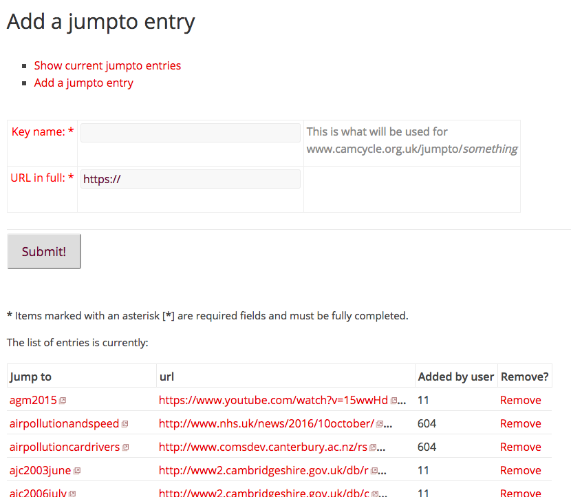

# Jumpto redirection system

This is a PHP application which implements a redirection system with simple user interface to create/remove interfaces.

Screenshot
----------

Usage
-----

1. Clone the repository.
2. Download the library dependencies and ensure they are in your PHP include_path.
3. Create a copy of the index.html.template file as index.html, and fill in the parameters.
4. Access the page in a browser at a URL which is served by the webserver.

Dependencies
------------

* [application.php application support library](http://download.geog.cam.ac.uk/projects/application/)
* [database.php database wrapper library](http://download.geog.cam.ac.uk/projects/database/)
* [pureContent.php site framework](http://download.geog.cam.ac.uk/projects/purecontent/)
* [ultimateForm.php form library](http://download.geog.cam.ac.uk/projects/ultimateform/)
* The Camcycle signin library

Author
------

Martin Lucas-Smith, Camcycle (the Cambridge Cycling Campaign), 2006-18.

License
-------

GPL2.

